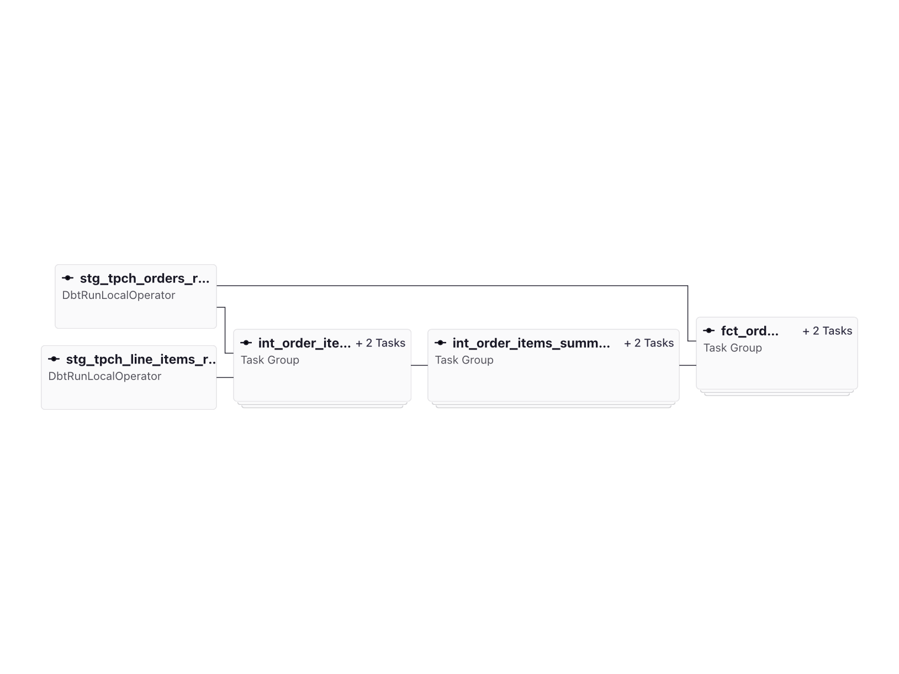
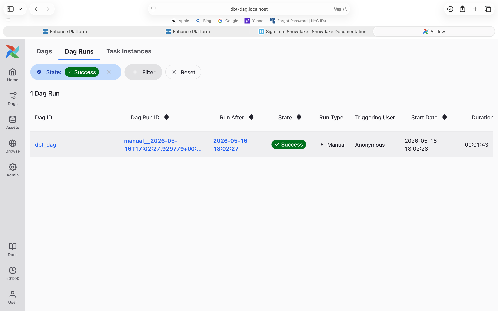
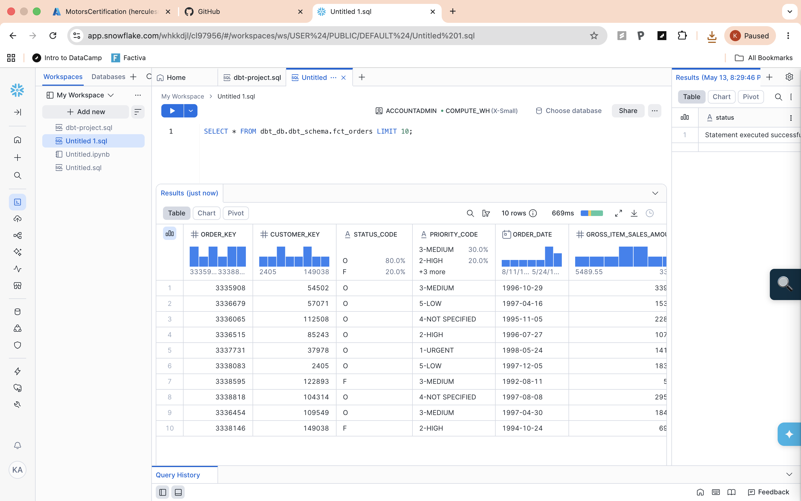

# dbt + Airflow + Snowflake ELT Pipeline

An end-to-end ELT pipeline that transforms Snowflake's TPC-H sample dataset using dbt, orchestrated by Apache Airflow through the Astronomer Cosmos integration.

## Tech Stack

- **Apache Airflow** — pipeline orchestration (via Astronomer Astro CLI)
- **dbt (data build tool)** — data transformation and testing
- **Snowflake** — cloud data warehouse
- **astronomer-cosmos** — native dbt-Airflow integration
- **Docker** — local environment via Astro Runtime

## Architecture

```
Snowflake Sample Data (SNOWFLAKE_SAMPLE_DATA.TPCH_SF1)
        |
        v
  Staging Layer (dbt views)
    stg_tpch_orders         -- renamed and cleaned orders
    stg_tpch_line_items     -- renamed and cleaned line items
        |
        v
  Intermediate Layer (dbt views)
    int_order_items         -- orders joined with line items
    int_order_items_summary -- aggregated sales amounts per order
        |
        v
  Mart Layer (dbt tables)
    fct_orders              -- final facts: gross/net sales, discounts
        |
        v
  Airflow DAG (scheduled @daily, powered by Cosmos)
```

## Project Structure

```
dbt-dag/
├── dags/
│   ├── dbt_dag.py                  # Airflow DAG definition using Cosmos
│   └── dbt/mydata_pipeline/
│       ├── models/
│       │   ├── staging/            # Source-aligned views
│       │   └── marts/              # Business-facing tables
│       ├── tests/                  # Custom data tests
│       ├── macros/                 # Reusable SQL macros
│       └── dbt_project.yml
├── Dockerfile                      # Astro Runtime image + dbt venv
├── requirements.txt                # Airflow providers
└── airflow_settings.yaml           # Local connections (gitignored)
```

## Screenshots

### Airflow DAG Graph
Each dbt model is rendered as an individual Airflow task with full dependency lineage via Cosmos.



### Successful DAG Run


### Pipeline Output — fct_orders in Snowflake


## Running Locally

### Prerequisites
- [Docker Desktop](https://www.docker.com/products/docker-desktop/)
- [Astro CLI](https://www.astronomer.io/docs/astro/cli/install-cli)
- A Snowflake account (free trial works)

### Setup

1. Clone the repo:
   ```bash
   git clone https://github.com/arifin-khairul/dbt-airflow-snowflake-pipeline.git
   cd dbt-airflow-snowflake-pipeline
   ```

2. Start the Airflow environment:
   ```bash
   astro dev start
   ```

3. Add your Snowflake connection in the Airflow UI at http://localhost:8080:
   - Go to **Admin → Connections → +**
   - Set **Connection Id** to `snowflake_conn`
   - Set **Connection Type** to `Snowflake`
   - Fill in your account, login, password, and the following extras:
     ```json
     {
       "account": "<your-account>",
       "warehouse": "dbt_wh",
       "database": "dbt_db",
       "role": "ACCOUNTADMIN"
     }
     ```

4. Create the required Snowflake objects:
   ```sql
   CREATE WAREHOUSE dbt_wh;
   CREATE DATABASE dbt_db;
   CREATE SCHEMA dbt_db.dbt_schema;
   ```

5. Trigger the `dbt_dag` DAG in the Airflow UI.
